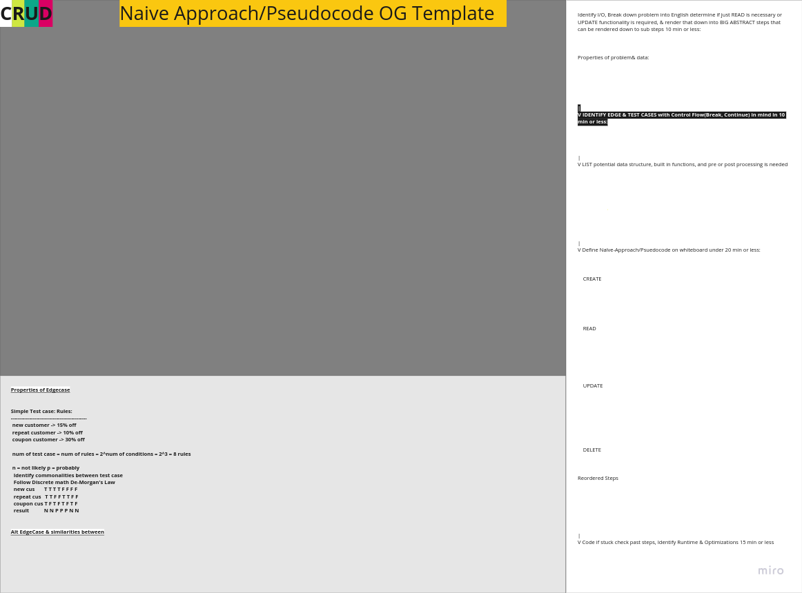

Dev Logic Gym is a purpose-built project dedicated to refining coding skills, strengthening problem-solving capabilities, and fostering logical thinking. This project serves as a centralized hub for coding challenges, providing a streamlined location for users to practice, learn, and track their progress.

```bash
# Shows project folder structure excluding these directories
tree -I 'node_modules|build|coverage'
```

## Algorithm Approach Types


The Brute Force approach, often considered the most straightforward method, involves systematically examining each element in a given context. For instance, when tackling an array traversal problem, employing the Brute Force approach entails visiting each element based on the specific requirements of the problem at hand.

The Naïve approach is an improvement over Brute Force, providing a better guess that is often more optimal, but it may still have room for further optimization or some times your best guess can end up being the most optimal choice.

Greedy algorithms/approach makes locally optimal choices at each stage, offering simplicity and speed in coding. However, they may not guarantee an overall optimal solution, especially in complex scenarios.

Optimal approaches aim for the most efficient solution based on the problem. While certain algorithm patterns may seem optimal, it depends on the specific problem at hand.

When tackling coding challenges, especially when implementing advanced patterns, refrain from defaulting to a specific coding pattern in your approach. Take the time to analyze the problem thoroughly, considering various factors, as blindly choosing a pattern may limit your perspective and hinder a comprehensive solution. Like for example assuming every string or array question best approach is either a sliding window or two pointer this is lazy thinking and waste time.

## Coding Regimine

*Master algorithms to be able to solve within 5 to 20 minutes
>[!note]
>Look on Glassdoor, and then checking Reddit and Quora you can also check their employees on LinkedIn and see if you have any mutual connections you can try to connect to find out about the type of interview question

1. **Focus on One Problem:**
    	- Identify problem area.
      - Pick one problem something simple like an array question or something.
      - Read problems and break them down to understand, don't solve practice doing this until you feel comfortable then revisit and solve. 
      - Keep in mind when to change  Approach
      - ***Consider Pair Programming when you get to Optimal approach level or Naive approach or once you fill that you have enough repetition***
  
2. **Bruteforce Solution:**
    - Come up with a Bruteforce solution to gain insight into the problem's dynamics.
    - Break the problem down until you understand it think about the Attributes of Data being passed.
  
3. **Naive Solution:**
    - Develop a naive solution, distinct from the Bruteforce approach.
    - Space out attempts, allowing time for fresh perspectives.
    - The Naive solution can be done `Imperatively` or `Declarative` consider doing both ways to see if you can do it.
    - Also think about Sorting algorithms in terms what can be applied, you don't necessarily need write one but you can use a pre-made sorting algorithm.
    - Lastly consider runtime complexity and data structures brainstorming thinking about their application in terms of access, searching, insertion, and deletion both `Linear` and `Non-Linear`.


4. **Optimal Solution & Grokking Algorithm Patterns:**
    >Consider Pair Programming here or in earlier approaches
    - Develop a Optimal approach
    - Consider experiment with looping iteratively and recursively.
    - Delve into advanced algorithm patterns for solution.
    - Think about what patterns can be used for the problem which can be solved with many different patterns depending on the problem itself.
    - Keep in mind that one pattern may be more Optimal then the other.
    - Create helper functions for code modularity also implement naming convention.

## Problem Solving Template Tablet Version
>Use Microsoft whiteboard and draw on to top of image




## Syllabus

### Patterns
#### Two Pointers(Typically Associated with Arrays & Strings, Linked List)
  - [ ] Pair with Target Sum (easy): LC #1
  - [ ] Triplet Sum to Zero (medium): LC #15
  - [ ] Triplet Sum Close to Target (medium): LC #16
  - [ ] Quadruple Sum to Target (medium): LC #18
  - [ ] Remove Duplicates (easy): LC #26
  - [ ] Dutch National Flag Problem (medium): LC #75
  - [ ] Triplets with Smaller Sum (medium): LC #259
  - [ ] Longest Repeating Character Replacement (hard): LC #424
  - [ ] Minimum Window Sort (medium): LC #581
  - [ ] Subarrays with Product Less than a Target (medium): LC #713
  - [ ] Comparing Strings containing Backspaces (medium): LC #844
  - [ ] Squaring a Sorted Array (easy): LC #977

#### Sliding Window(Associated with Sorted Arrays)
  - [ ] No-repeat Substring (hard): LC #3
  - [ ] Words Concatenation (hard): LC #30
  - [ ] Maximum Sum Subarray of Size K (easy) LC #53
  - [ ] Smallest Window Containing Substring (hard): LC #76
  - [ ] Smallest Subarray with a given sum (easy): LC #209
  - [ ] Longest Substring with K Distinct Characters (medium): LC #340
  - [ ] Find String Anagrams (hard): LC #438
  - [ ] Find Permutation in string (hard): LC #567
  - [ ] Fruits into Baskets (medium): LC #904
  - [ ] Max Consecutive Ones III (hard): LC #1004


#### Backtracking(2 dimensional array and Subsets)
  - [ ] Balanced Parentheses (hard): LC #22
  - [ ] Permutations (medium): LC #46
  - [ ] Subsets (easy): LC #78
  - [ ] Subsets With Duplicates (easy): LC #90
  - [ ] Structurally Unique Binary Search Trees (hard): LC #95(Binary Tree)
  - [ ] Count of Structurally Unique Binary Search Trees (hard): LC #96(Binary Tree)
  - [ ] Evaluate Expression (hard): LC #241
  - [ ] Unique Generalized Abbreviations (hard): LC #320
  - [ ] String Permutations by changing case (medium): LC #784


#### Modified Binary Search(Associated with Sorted Arrays & Binary Search Tree)
  - [ ] Search in Rotated Array (medium): LC #33
  - [ ] Number Range (medium): LC #34
  - [ ] Ceiling of a Number (easy): LC #35
  - [ ] Search in Rotated Array II (medium): LC #81
  - [ ] Find Minimum in Rotated Sorted Array (medium): LC #153
  - [ ] Find Minimum in Rotated Sorted Array II (medium): LC #154
  - [ ] Longest Increasing Subsequence(medium): LC #300
  - [ ] Minimum Difference Element (medium): LC #658 (k == 1)
  - [ ] Search in a Sorted Infinite Array (medium): LC #702
  - [ ] Order-agnostic Binary Search (easy): LC #704
  - [ ] Next Letter (medium): LC #744


#### Fast & Slow Pointers(Linked List & Arrays)
  - [ ] LinkedList Cycle (easy): LC #141
  - [ ] Start of LinkedList Cycle (medium): LC #142
  - [ ] Rearrange a LinkedList (medium): LC #143
  - [ ] Happy Number (medium): LC #202
  - [ ] Palindrome LinkedList (medium): LC #234
  - [ ] Cycle in a Circular Array (hard): LC #457
  - [ ] Middle of the LinkedList (easy): LC #876


#### In Place Reversal of a Linked List
  - [ ] Add Two Numbers (medium): LC #2
  - [ ] Reverse every K-element Sub-list( Reverse Nodes in k-Group) (hard): LC #25
  - [ ] Rotate a LinkedList (medium): LC #61
  - [ ] Reverse a Sub-list (medium): LC #92
  - [ ] Reverse a LinkedList (easy): LC #206


#### BFS(Trees & Graph)
  - [ ] Same Tree(easy) LC #100
  - [ ] Symmetric Tree (easy): LC #101
  - [ ] Binary Tree Level Order Traversal (easy): LC #102
  - [ ] Zigzag Traversal (medium): LC #103
  - [ ] Maximum Depth of a Binary Tree (easy): LC #104
  - [ ] Reverse Level Order Traversal II (easy): LC #107
  - [ ] Minimum Depth of a Binary Tree (easy): LC #111
  - [ ] Connect All Level Order Siblings (medium): LC maybe #116
  - [ ] Connect Level Order Siblings (medium): LC #117
  - [ ] Right View of a Binary Tree (easy): LC #199
  - [ ] Level Averages in a Binary Tree (easy): LC #637

#### DFS(Trees & Graph)
  - [ ] Binary Tree Path Sum (easy): LC #112
  - [ ] Path Sum II (medium): LC #113
  - [ ] Path with Maximum Sum (hard): LC #124
  - [ ] Sum of Path Numbers (medium): LC #129
  - [ ] Binary Tree Paths (medium): LC #257
  - [ ] Count Paths for a Sum (medium): LC #437
  - [ ] Tree Diameter (medium): LC #543
  - [ ] Path With Given Sequence (medium): LC #1430


#### Knapsack
>[!note]
> knapsack utilizes Dynamic problem also known as Tabulation(bottom-up) or Memoization(top-down)
  - [ ] Longest Palindromic Substring(medium): LC #5
      (uses bottom up or top down)
  - [ ] House Robber(medium): LC #198
      (uses bottom up or top down)
  - [ ] Coin Change (medium): LC #322
  - [ ] Equal Subset Sum Partition (medium): LC #416
  - [ ] Target Sum (hard): LC #494
  - [ ] Coin Change 2 (medium): LC #518
  - [ ] Minimum Cost For Tickets (medium): LC #983

#### Greedy Algorithm/Approach
  - [ ] Container With Most Water (medium): LC #11
  - [ ] Wildcard Matching (hard): LC #44
  - [ ] Jump Game II	(medium): LC #45
  - [ ] Jump Game (medium): LC #55
  - [ ] Best Time to Buy and Sell Stock II (medium): LC #122
  - [ ] Gas Station (medium): LC #134
  - [ ] Longest Palindrome (easy): LC #409

#### Bitwise XOR
  - [ ] Single Number (easy): LC #136
  - [ ] Two Single Numbers (medium): LC #260
  - [ ] Complement of Base 10 Number (medium): LC #476
  - [ ] Problem Statement (hard): LC #832


### Advanced Data Structures
#### Doubly-Linked List(PERSONAl Review)
  - [ ] LRU Cache (medium): LC #146
  - [ ] Flatten a Multilevel Doubly Linked List (medium): LC #430
  - [ ] All O`one Data Structure (Hard): LC #432
  - [ ] LFU Cache (Hard): LC #460
  - [ ] Design Browser History (medium): LC #1472


#### Heaps
  - [ ] Find the Median of a Number Stream (medium): LC #295
  - [ ] Next Interval (hard): LC #436
  - [ ] Sliding Window Median (hard): LC #480
  - [ ] Maximize Capital (hard): LC #502

#### Graph
  - [ ] Clone Graph (hard): LC #133
  - [ ] Reconstruct Itinerary (hard): LC #332
  - [ ] Network Delay Time (medium): LC #743
  - [ ] Cracking the Safe (hard): LC #753


### Merge Patterns
#### Merge Intervals(2 dimensional array)
  - [ ] Merge Intervals (medium): LC #56
  - [ ] Insert Interval (medium): LC #57
  - [ ] Conflicting Appointments (medium): LC #252
  - [ ] Minimum Meeting Rooms (hard): LC #253
  - [ ] Maximum CPU Load(Task Scheduler) (hard): LC proably #621
  - [ ] Employee Free Time (hard): LC #759
  - [ ] Intervals Intersection (medium): LC #986

#### K-way Merge(Priority queue, and merging sorted arrays)
  - [ ] Merge K Sorted Lists (Hard): LC #23
  - [ ] Problem K Pairs with Largest Sums (Hard): LC #373
  - [ ] Kth Smallest Number in a Sorted Matrix (Hard): LC #378
  - [ ] Smallest Number Range (Hard): LC #632


### Sort Patterns

#### Cyclic Sort(Associated with Arrays in range of numbers)
  - [ ] Cyclic Sort (easy)
  - [ ] Find the Smallest Missing Positive Number (medium): LC #41
  - [ ] Find the Missing Number (easy): LC #268
  - [ ] Find the Duplicate Number (easy): LC #287
  - [ ] Find all Duplicate Numbers (easy): LC #442
  - [ ] Find All Numbers Disappeared in an Array (easy): LC #448
  - [ ] Find the Corrupt Pair (easy): LC #645
  - [ ] Find the First K Missing Positive Numbers (hard): LC proably #1539


#### Topological Sort (Graphs)
  - [ ] Tasks Scheduling (medium): LC #207
  - [ ] Tasks Scheduling Order (medium): LC #210
  - [ ] Minimum Height Trees (hard): LC #310


#### Top K Elements(Priority queue and heaps)
  - [ ] Kth Smallest Number (easy): LC #215
  - [ ] Top 'K' Frequent Numbers (medium): LC #347
  - [ ] Rearrange String K Distance Apart (hard): LC #358
  - [ ] Frequency Sort (medium): LC #451
  - [ ] Scheduling Tasks (hard): LC #621(Greedy)
  - [ ] 'K' Closest Numbers (medium): LC #658
  - [ ] Kth Largest Number in a Stream (medium): LC #703
  - [ ] Rearrange String (hard): LC #767(Greedy)
  - [ ] Frequency Stack (hard): LC #895
  - [ ] 'K' Closest Points to the Origin (easy): LC #973
  - [ ] Connect Ropes (easy): LC #1167
  
  - [ ] Whiteboard Heap Removal
    - Easiest Implementation Using Arrays
    - Insertion and Bubbling Up Operations
    - Removing Elements (Bubble Down)
 


### Extra Problems
  - [ ] Longest Common Prefix (easy): LC #14
  - [ ] Valid Parentheses (easy): LC #20
  - [ ] Group Anagrams (medium): LC #49
  - [ ] Climbing Stairs(easy): LC #70
  - [ ] Edit Distance(hard): LC #72
  - [ ] Search a 2D Matrix(medium): LC #74
  - [ ] Distinct Subsequences(hard): LC #115
  - [ ] Valid Anagram (easy): LC #242
  - [ ] First Unique Character in a String (easy): LC #387
  - [ ] Validate IP Address (medium): LC #468
  - [ ] Longest Palindromic Subsequence(medium): LC #516
  - [ ] Distribute Candies (easy): LC #575
  - [ ] Palindromic Substrings(medium): LC #647
  - [ ] Super Egg Drop(hard): LC #887
  - [ ] Distribute Candies to People(easy): LC #1103
  - [ ] Longest Common Subsequence(medium): LC #1143
  - [ ] Maximum Alternating Subsequence Sum(medium): LC #1911


